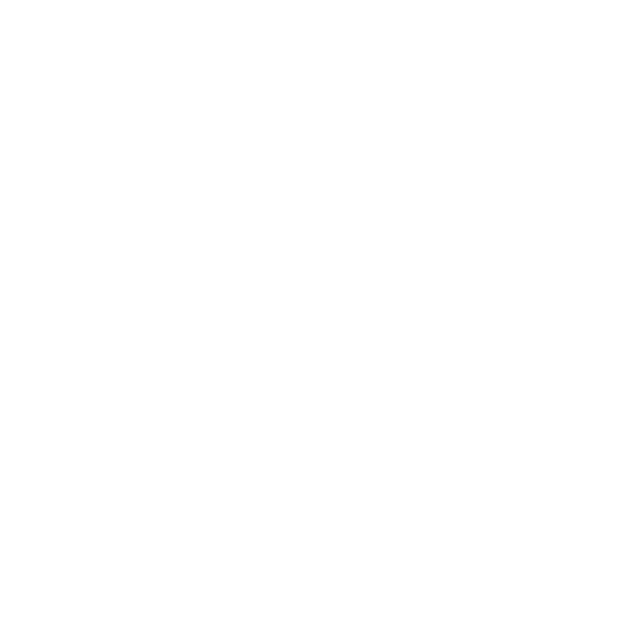
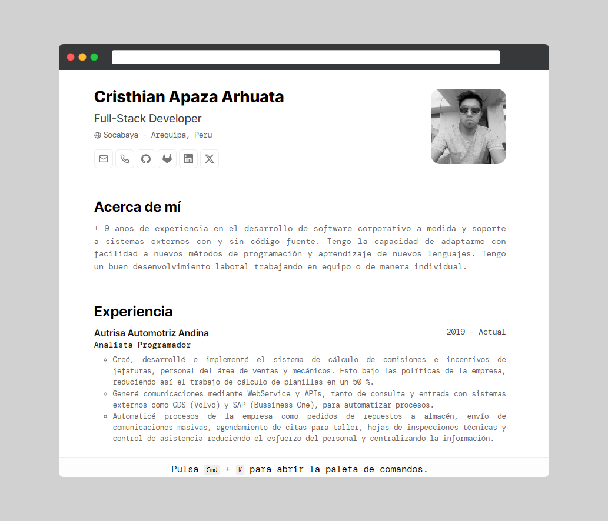

<div align="center">
    
    <h1>
        Portafolio Minimalista Web
    </h1>
</div>

<div align="center">


</div>

<div align="center">
    <a href="#menciones">
        Menciones
    </a>
    <span>&nbsp;✦&nbsp;</span>
    <a href="#preview">
        Preview
    </a>
    <span>&nbsp;✦&nbsp;</span>
    <a href="#herramientas">
        Herramientas
    </a>
    <span>&nbsp;✦&nbsp;</span>
    <a href="#estructura-del-proyecto">
        Estructura del Proyecto
    </a>
    <span>&nbsp;✦&nbsp;</span>
    <a href="#comandos">
        Comandos
    </a>
    <span>&nbsp;✦&nbsp;</span>
    <a href="#licencia">
        Licencia
    </a>
    <span>&nbsp;✦&nbsp;</span>
    <a href="#autores">
        Autores
    </a>
</div>

## Menciones
* Diseño basado en [**Bartosz Jarocki**](https://github.com/BartoszJarocki/cv)
* Código de guia de [**Miguel Ángel Durán**](https://github.com/midudev/minimalist-portfolio-json)

## Preview
</img>

## Herramientas

- [**Astro**](https://astro.build/) - Framework de aplicaciones web basado en JavaScript de código abierto.
- [**Typescript**](https://www.typescriptlang.org/) - Lenguaje de programación libre y de código abierto desarrollado y mantenido por Microsoft..
- [**Ninja Keys**](https://github.com/ssleptsov/ninja-keys) - Menu desplegable con atajos de teclado hecho en puro Javascript.
- [**JSON Resume**](https://jsonresume.org/schema/) - La iniciativa de código abierto para crear un estándar basado en JSON para currículums. Para desarrolladores, por desarrolladores.

## Estructura del Proyecto

El proyecto tiene la siguiente estructura de carpetas y archivos:

```text
/
├── public/
│   ├── favicon.svg
│   └── certificates-*.svg
├── src/
│   ├── components/
│   │   ├── sections/
│   │   └── components-*.astro
│   ├── data/
│   │   └── resume.json
│   ├── icons/
│   │   └── icons-svg-*.astro
│   ├── layouts/
│   │   └── layouts-*.astro
│   └── pages/
│       └── index.astro
├── package.json
├── LICENSE.json
└── README.json
```
Cualquier archivo estático, como imágenes, se puede colocar en el directorio `public/`.

## Comandos

Todos los comandos se ejecutan desde la raíz del proyecto, desde una terminal:

| Command                   | Action                                           |
| :------------------------ | :----------------------------------------------- |
| `npm install`             | Instalar dependencias                            |
| `npm run dev`             | Iniciar la apliación `localhost:4321`            |
| `npm run build`           | Compilar la aplicación `./dist/`                 |
| `npm run preview`         | Vista previa de compilación , antes de implementarla |

## Licencia

* [**MIT**: ](LICENSE.txt)Esta licencia permite a los usuarios utilizar, modificar y distribuir el software sin restricciones, siempre y cuando se proporcione atribución al autor original y se incluya un aviso de derechos de autor en todas las copias del software

## Autores
* Cristhian Apáza - cristhian.cjaa@gmail.com
[![LinkedIn][linkedin-shield]][linkedin-1-url]

<p align="right">(<a href="#top">back to top</a>)</p>

[linkedin-shield]: https://img.shields.io/badge/-LinkedIn-black.svg?style=for-the-badge&logo=linkedin&colorB=555
[linkedin-1-url]: https://www.linkedin.com/in/cristhian-apaza/